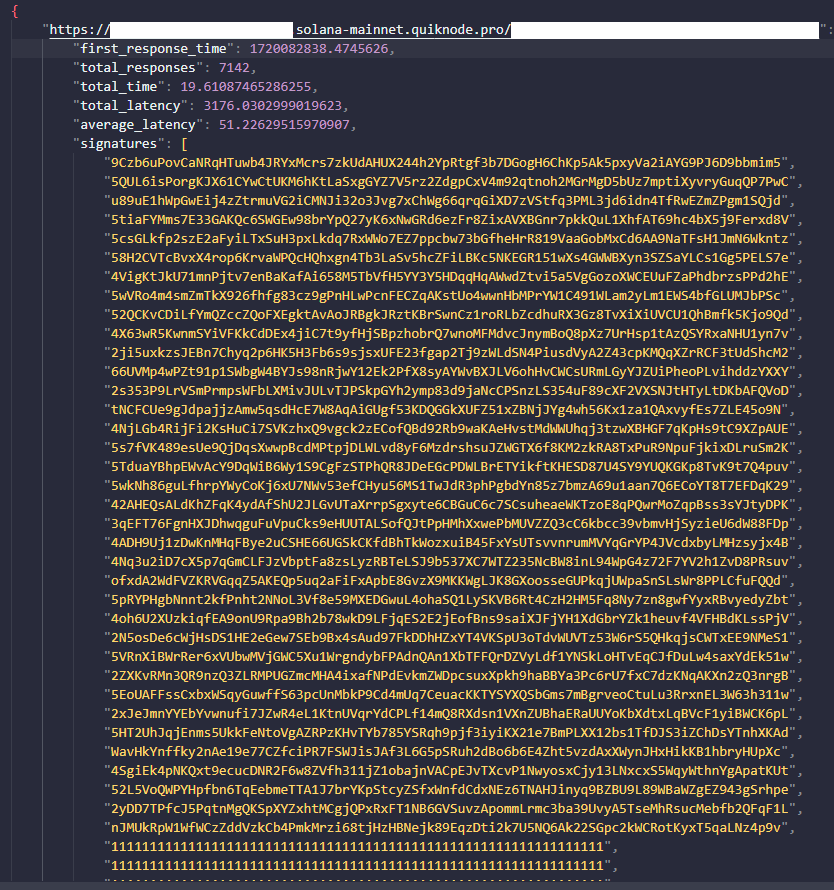

# RPC-Benchmark
This is a simple command line benchmarking tool for Solana RPC servers. It primarily analyzes how stale/old incoming transactions from the RPC are. This is best used to compare the performance characteristics of different RPC providers in projects related to DeFi, MEV, and HFT.

This test uses the [logSubscribe](https://solana.com/docs/rpc/websocket/logssubscribe) websocket RPC method.

## Usage

1. Install Dependencies
```bash
pip install -r requirements.txt
```

2. Run the script using the correct command line arguments
```bash
python main.py <input_file> <test_time> <sampling_fraction> <output_file>
```

3. View test results in your out file :)


#### Example Start
```bash
python main.py rpcs.txt 15 0.03 rpc_stats.json
```
> rpcs.txt is the inputfile containing all the rpc information

> 15 is the max duration spent on each RPC when collecting transactions 

> 0.03 represents the % of transactions that will be randomly selected to represent the performance of the RPC. This is because it is costly and wasteful to send thousands-upon-thousands of HTTP requests for no reason.

> rpc_stats.json is the output file for the statistics

### Example Inputfile
```plaintext
wss://solana-mainnet.core.chainstack.com/xxxxxxxxxxxxxxxxxxxxxxxxxx
wss://xxxxxxxxxxxx.solana-mainnet.quiknode.pro/xxxxxxxxxxxxxxxxxxx
```

### Other Notes

- I wouldn't personally set the time too high on test_time. It may consume too much memory over longer periods of time and isn't worth the increased bandwidth usage.
- The main datapoint of interest inside of your outfile is average_latency. This tells you how many seconds old, on average, each received transaction is. The other data is mostly useless for most people.
- I could imagine this program could be made better. Please contribute if you have the time or need.

